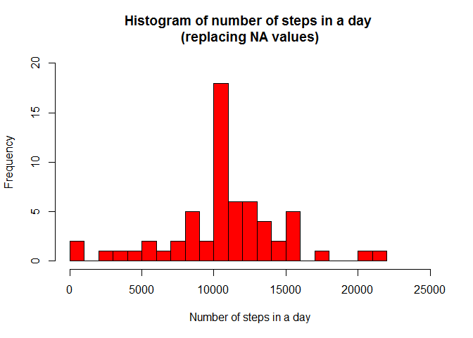
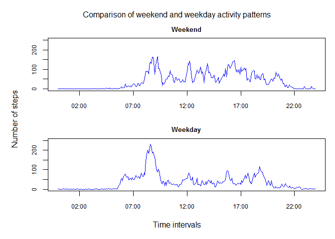

# Reproducible Research: Peer Assessment 1


This is a summary of my analysis of the fitness activity data.

The goal was to analyse the total number of steps taken per day and per time interval, over a 2 month period (October and November 2012)l

## Loading and preprocessing the data
For the first part of the analysis, I unzipped the raw data and read the csv-formatted data

```r
fname <- "activity.zip"
if (!file.exists(fname))
    print("Cannot find zip data file in local directory")
unzip(fname)
## After unzipping, read the data in CSV format
activity <- read.csv("activity.csv")
```

## What is the average daily activity pattern?

For the initial analysis of the data, NA data is ignored. I create a new data structure that just includes the non-NA data, and use that data to plot a histogram that shows the total number of steps taken per day. 


```r
values <- activity[!is.na(activity$steps),]

## Calculate the total number of steps by date
daily_totals <- data.frame(unlist(lapply(split(values, values$date), function(x) sum(x$steps))))
names(daily_totals) <- "total_steps"
hist(as.numeric(daily_totals$total_steps), breaks = 20, xlim = c(0,25000), ylim = c(0,12), col = "red",
    main = "Histogram of number of steps in a day \n (Oct/Nov 2012)",
	  xlab = "Number of steps in a day")
```

 

The histogram shows that there were 10 days when less than 1,000 steps were taken, and only 2 days when more than 20,000 steps were taken.

As a next step, I calculate and report the mean and median values

```r
mn <- mean(daily_totals$total_steps)
print(paste("Mean number of daily steps is", mn))
```

```
## [1] "Mean number of daily steps is 9354.22950819672"
```

```r
md <- median(daily_totals$total_steps)
print(paste("Median number of daily steps is", md))
```

```
## [1] "Median number of daily steps is 10395"
```
The mean number of steps taken in a day is approximately 9354, while the median of the number of daily steps is 10395, as also shown in this updated histogram.

```r
hist(as.numeric(daily_totals$total_steps), breaks = 20, xlim = c(0,25000), ylim = c(0,12), col = "red",
  main = "Histogram of number of steps in a day \n (Oct/Nov 2012)",
  xlab = "Number of steps in a day")
abline(v = mean(daily_totals$total_steps), col = "blue", lwd = 2)
abline(v = median(daily_totals$total_steps), col = "green", lwd = 2)
legend("topright", legend = c("mean","median"), 
       col = c("blue", "green"), lwd = 2)
```

 

## Calculating the average daily activity pattern
Next, I analysed the mean number of steps taken per 5-minute time interval. To correctly display the values, the interval values must be tranformed from integers into time values.

```r
## Calculate the mean number of steps by time interval
interval_means <- data.frame(unlist(lapply(split(values, values$interval), function(x) mean(x$steps))))
names(interval_means) <- "mean_steps"
intervals <- strptime(sprintf("%04d", as.numeric(unique(values$interval))),        format="%H%M")
plot(intervals, as.numeric(interval_means$mean_steps), type = "l",
     xlab = "Time Intervals", ylab = "Number of steps per interval",
     main = "Mean number of steps per 5-minute time intervals")
```

 

I now calculate the time interval which has the highest mean number of steps.

```r
## Calculate the time interval with the highest number of steps
interval_totals <- data.frame(unlist(lapply(split(values, values$interval), function(x) sum(x$steps))))
names(interval_totals) <- "total_steps"
x <- which.max(interval_totals$total_steps)
y <- max(interval_totals$total_steps)
n <- rownames(interval_totals)
max <- strptime(sprintf("%04d", as.numeric(n[x])), format="%H%M")
t <- as.POSIXlt(max)
print(paste("Time interval with highest total number of steps is ",t$hour,":", t$min, sep=""))
```

```
## [1] "Time interval with highest total number of steps is 8:35"
```

The time interval with the highest total number of steps occurs at 8:35, and that 10927 steps were taken in total during that time interval over the observed period.

## Imputing missing values

In the analysis so far, I have ignored time intervals that contained NA values. 

```r
## How many time intervals have NA values ?
s <- sum(is.na(activity$steps))
print(paste("There are",s,"time intervals with NA values"))
```

```
## [1] "There are 2304 time intervals with NA values"
```

I create a new data set in which all of NA values are replaced by the mean value for the same interval. 

```r
## Replace each NA value by the mean value for the same interval 
## on other dates
activity2 <- activity
for (k in 1:nrow(activity2)) {
  if (is.na(activity2[k,"steps"])) {	
		t <- activity2[k,"interval"]
		activity2[k,"steps"] <- interval_means[as.character(t),"mean_steps"]
		}
	}
```

We can now draw a new histogram of total daily steps, and calculate the updated mean and median number of daily steps, using the updated data set, to see the impact of replacing NA values with calculated values.

```r
## Calculate the total number of steps by date
daily_totals2 <- data.frame(unlist(lapply(split(activity2, activity2$date), function(x) sum(x$steps))))
names(daily_totals2) <- "total_steps"
mn2 <- mean(daily_totals2$total_steps)
print(paste("Mean number of daily steps is", mn2))
```

```
## [1] "Mean number of daily steps is 10766.1886792453"
```

```r
md2 <- median(daily_totals2$total_steps)
print(paste("Median number of daily steps is", md2))
```

```
## [1] "Median number of daily steps is 10766.1886792453"
```

```r
hist(as.numeric(daily_totals2$total_steps), breaks = 20, xlim = c(0,25000), ylim = c(0,12), col = "red",
    main = "Histogram of number of steps in a day \n(replacing NA values)",
    xlab = "Number of steps in a day")
```

 

We can see that, having replaced the NA values with calculated values, the mean number of steps taken in a day has increased to approximately 10766, while the median of the number of daily steps is identical to the mean (10766) Also, there are now only 2 days with fewer than 1000 steps.

## Are there differences in activity patterns between weekdays and weekends?
For the final part of the analysis, I split the data set into weekdays (Monday to Friday) and weekends (Saturday and Sunday), to see if average daily activity pattern different between weekdays and weekends.

```r
## Define a function to determine the day of the week
wd <- function(x) if(weekdays(as.Date(x)) %in% c("Saturday", "Sunday")) 
  "WEEKEND" else "WEEKDAY"

## Split the updated data set by weekday and weekend
activity2$wd <- lapply(activity2$date, wd)
options(stringsAsFactors = TRUE)
wd_activity <- activity2[(activity2$wd == "WEEKDAY"),]
we_activity <- activity2[(activity2$wd == "WEEKEND"),]
```

Now re-draw the mean number of steps per time interval for those two subsets.

This is the plot for weekdays ...

```r
## Now, redraw the two plots for weekdays and weekends

wd_means <- data.frame(unlist(lapply(split(wd_activity, wd_activity$interval), function(x) mean(x$steps))))
names(wd_means) <- "mean_steps"
plot(intervals, as.numeric(wd_means$mean_steps), type = "l", col = "blue",
     main = "Mean number of steps by time interval on weekdays",
     xlab = "Time Interval", ylab = "Average number of steps")
```

 

And this is the plot for weekends ...

```r
we_means <- data.frame(unlist(lapply(split(we_activity, we_activity$interval), function(x) mean(x$steps))))
names(we_means) <- "mean_steps"
plot(intervals, as.numeric(we_means$mean_steps), type = "l", col = "blue",
     main = "Mean number of steps by time interval on weekends",
     xlab = "Time Interval", ylab = "Average number of steps")
```

 

As we can see, the average daily activity pattern has shifted to the right (i.e. to later in the day) on weekend days, compared to weekdays.
